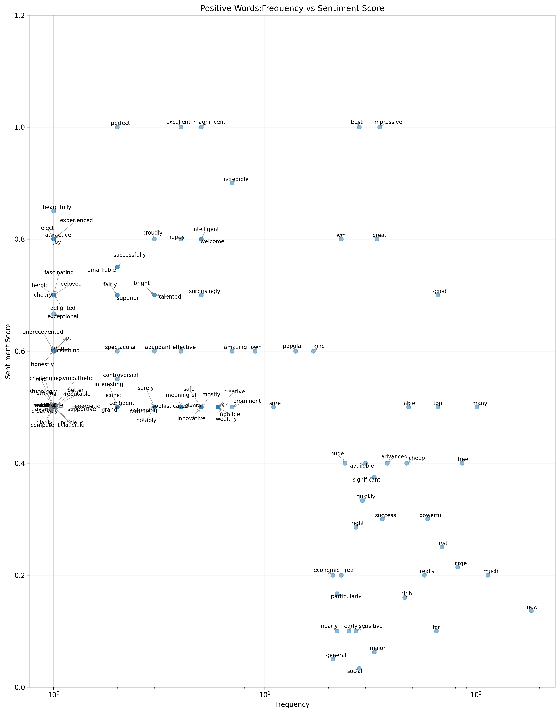
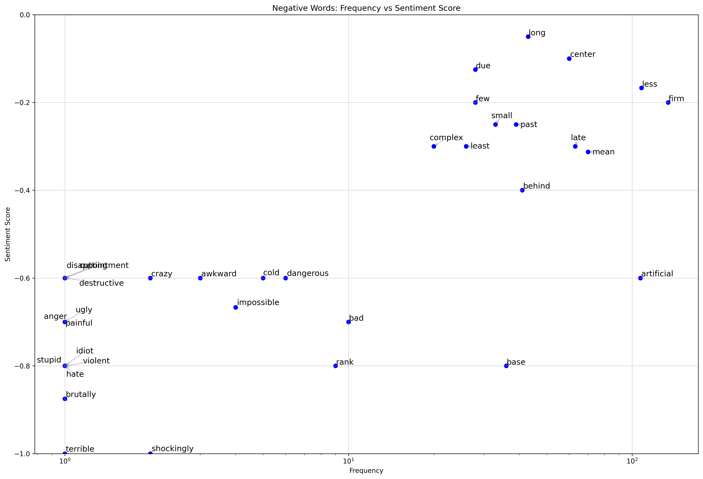
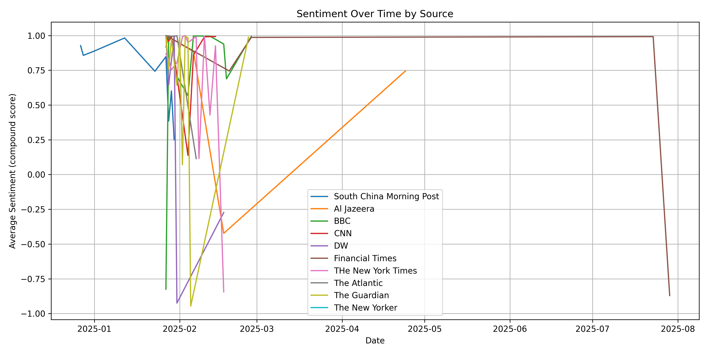

# Text Analysis of News Coverage

## Project Overview
This project analyzes sentiment trends and key discussion topics from international news coverage using Python and Jupyter Notebooks. It demonstrates the application of Natural Language Processing (NLP) techniques, exploratory data analysis, and data visualization in a real-world scenario.


## Project Background

This project began in February–March 2025 as part of the master's course **Distant Reading** in Digital Humanities. At that time, news about **DeepSeek** had just emerged, and we had a mini-project assignment for the course. I decided to analyze newsletters about DeepSeek out of curiosity, using the opportunity to explore media coverage of this trending topic.

The initial version of the project was completed under tight time constraints, so the first version was raw, with a small corpus and limited depth.

During the summer of 2025, I revisited the project with more time to study and apply methods from the learning material. I expanded the corpus and reworked the analysis, producing this new version with a more structured workflow, larger dataset, and improved insights.

## About This Project

Unlike the diverse datasets used in the course assignments of *Introduction to Cultural Analytics and Python*, this project focuses on a **single corpus** centered around the topical and timely news theme of **DeepSeek**. By using one unified dataset of newsletters and articles, the analysis aims to provide a clear, coherent investigation into what topics are discussed and the sentiments expressed in the media coverage.

The main workflow involves:

- Collecting an expanded corpus of media articles about DeepSeek
- Applying text mining techniques such as TF-IDF to identify unique and frequent words
- Using topic modeling to explore thematic structures, though limited by the relatively small and specialized corpus, which makes distinct topic separation somewhat ambiguous
- Conducting sentiment analysis that reveals notable patterns, including sentiment shifts over time and identifying articles with strongly negative sentiment
## 📁 Project Structure


```
DeepSeek_Media_Text_Analysis/
├── 1_Datacollection/        # Raw data & metadata
├── 2_Preprocessing/         # Text cleaning
├── 3_TF-IDF/                # Feature words extraction
├── 4_topic_modeling/        # Topic modeling
├── 5_sentiment_analysis/    # Sentiment analysis on both texts and words
└── README.md                # Documentation
```
## Example Output


One of the valuable outputs of this project is an interesting two-dimensional visualization that maps word frequency against sentiment scores, helping to surface meaningful insights from the text data.



Overall, this project reflects a focused curiosity about media narratives surrounding DeepSeek, integrating computational analysis with interpretive perspectives to reveal meaningful patterns and insights.


## 🚀 Main Features

- Text preprocessing and cleaning with Python
- Sentiment analysis using lexicons and frequency calculations
- Topic modeling using LDA (Latent Dirichlet Allocation)
- Data visualization with Matplotlib
- Interactive exploratory analysis in Jupyter Notebooks

## 🛠️ Tools and Libraries Used

- Python 3.x
- Jupyter Notebook
- Pandas
- NLTK
- Gensim
- Matplotlib

## 📌 How to Use

1. Clone or download this repository to your local machine.
2. Install the required Python packages using:
   ```
   pip install -r requirements.txt
   ```
3. Open the notebooks with Jupyter:
   ```
   jupyter notebook
   ```
4. Navigate to the `notebooks/` folder and run the notebook step by step to reproduce the analysis.

## 💡 Author

**Lu Zhang**  
Ph.D. in Social History, transitioning into Data Science with a focus on text analysis and data visualization. Currently pursuing a Master's in Digital Humanities at Uppsala University, Sweden.
